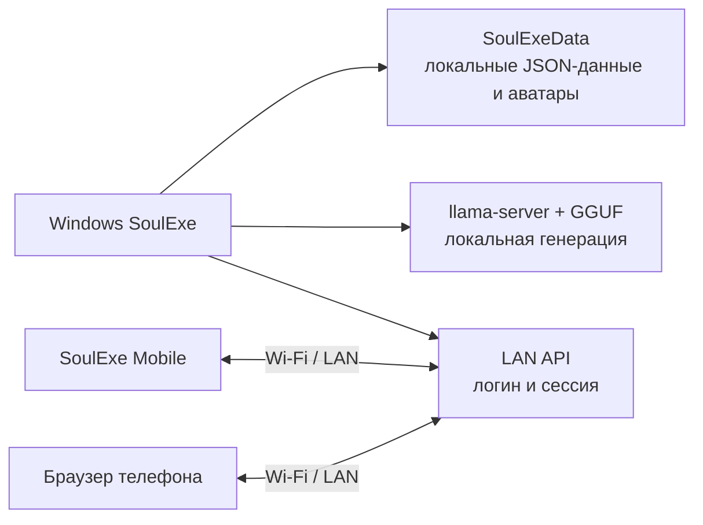

# SoulExe

**SoulExe** — локальная система для ролевых ИИ-диалогов, персонажей и автоматических сцен. Основной Windows-клиент запускает локальную языковую модель, хранит данные рядом с программой и по желанию открывает защищённый доступ для мобильного клиента в домашней Wi‑Fi/LAN-сети. Проект не требует облачного хранения переписок.

> SoulExe предназначен для работы с **локальной LLM** через `llama-server` и GGUF-модели. Качество, скорость и следование роли зависят от выбранной модели, её квантизации и параметров запуска.

## Что умеет SoulExe

| Область | Возможности |
|---|---|
| **Диалоги** | Несколько чатов на персонажа, поиск, переименование, закрепление, продолжение ответа, последние сообщения и дата-разделители. |
| **Ролевая подача** | Локальное оформление речи, действий в `*звёздочках*`, мыслей и `<think>`-блоков; можно скрывать визуальные маркеры без изменения текста в истории. |
| **Персонажи и библиотека** | Карточки персонажей, аватары, описание, характер, сценарий, системный промпт, лор, импорт и экспорт карт. |
| **Персоны пользователя** | Переиспользуемые описания роли пользователя: имя, постоянные факты, контекст и фото-аватар. Персона подключается к выбранному персонажу и дополняет его контекст. |
| **Память** | Краткая сводка и Soul Memory с фоновым обслуживанием после паузы в чтении, чтобы не задерживать выдачу основного ответа. |
| **Сцены** | Два персонажа, сценарий, место, время, цель, отношения, правила развития, ручные или автоматические ходы, пауза и режиссёрские события. |
| **Mobile** | Локальный вход по логину и паролю, чаты, сцены, персонажи, редактирование, загрузка аватаров, демо-режим и синхронизация с ПК. |

Полное описание возможностей: [docs/FEATURES_RU.md](docs/FEATURES_RU.md).

## Windows, Mobile и локальный веб-клиент

SoulExe состоит из нескольких интерфейсов для одной локальной базы данных. Windows-клиент является главным местом управления моделью и библиотекой. Mobile-клиент работает на телефоне и подключается к запущенному ПК по локальной сети. Встроенный веб-клиент также использует тот же LAN API и открывается в браузере телефона.

| Интерфейс | Для чего использовать | Что важно |
|---|---|---|
| **Windows WPF** | Настройка модели, библиотека, подробный редактор, память, лор, сцены и локальный сервер. | Главный локальный клиент; данные находятся в `SoulExeData` рядом с EXE. |
| **SoulExe Mobile** | Быстрый доступ к чатам, сценам и персонажам с телефона в той же сети. | Телефон не запускает модель: он отправляет действия на ПК. |
| **LAN веб-клиент** | Доступ из браузера без установки Mobile-приложения. | Использует тот же пароль и тот же локальный сервер, что Mobile. |

Подробное сравнение и архитектура: [docs/ARCHITECTURE_RU.md](docs/ARCHITECTURE_RU.md).

## Преимущества подхода

SoulExe делает упор не на облачный чат-сервис, а на управляемую локальную среду. Переписки, карточки, лор, память и аватары остаются на компьютере пользователя. Модель можно выбирать самостоятельно в формате GGUF, а мобильная версия не дублирует базу данных: она синхронизируется с тем же Windows-экземпляром через LAN.

Это даёт прозрачное хранение данных, возможность работать без внешнего API после настройки локального рантайма и единый набор персонажей на ПК и телефоне. Компромисс состоит в том, что компьютер должен быть включён, модель должна быть запущена или доступна локально, а мобильному устройству требуется подключение к той же доверенной сети.

## Быстрый старт

### Установка из релиза

1. Откройте [Releases](https://github.com/wericool/SoulExe/releases) и скачайте `SoulExe-Windows-x64-*.zip`.
2. Распакуйте архив и запустите `SoulExe.exe`.
3. В параметрах укажите локальный `llama-server.exe` и GGUF-модель либо воспользуйтесь доступными установочными шагами приложения.
4. Чтобы подключить телефон, откройте **Параметры → Мобильный**, задайте логин и пароль и включите сервер или переключатель его автозапуска.
5. Установите APK из `soulexe-mobile-*.zip`, подключите телефон к той же Wi‑Fi-сети и войдите по LAN-адресу ПК.

Для работы с исходниками и более подробной настройки используйте [docs/GETTING_STARTED_RU.md](docs/GETTING_STARTED_RU.md).

## Схема работы



## Репозиторий

| Каталог | Содержимое |
|---|---|
| `desktop/` | Windows WPF-клиент на .NET 8, локальный API, память, библиотека, сцены и встроенный веб-клиент. |
| `mobile/` | Expo/React Native-клиент; в релизах сейчас публикуется Android APK. |
| `docs/` | Русскоязычная документация по функциям, архитектуре и запуску. |

В Git намеренно **не попадают** EXE/APK, ZIP-архивы, `bin/`, `obj/`, `node_modules/`, Expo-кэши, логи, `.env`, токены, `SoulExeData` и реальные переписки. Готовые бинарные пакеты размещаются только в [Releases](https://github.com/wericool/SoulExe/releases).

## Исходники

### Windows

Для сборки нужен Windows с .NET 8 SDK и Windows SDK:

```powershell
dotnet build desktop/SoulTextWpf.csproj -c Release
```

### Mobile

Нужны Node.js, pnpm и окружение Expo:

```bash
cd mobile
pnpm install
pnpm check
pnpm test
pnpm android
```

## Локальная безопасность и ограничения

LAN API рассчитан на доверенную домашнюю сеть. Не открывайте порт SoulExe напрямую в интернет и используйте непустой пароль в настройках «Мобильный». Полноценная генерация выполняется на ПК, поэтому телефон не сможет самостоятельно отвечать, если Windows-клиент и его локальный сервер выключены. Текущая загрузка истории в интерфейсах ориентирована на свежий компактный срез сообщений; полноценная постраничная навигация к очень старой переписке пока не реализована.

## Происхождение и лицензия

SoulExe является отдельной развиваемой версией. Оригинальный проект [Soul of Waifu](https://github.com/jofizcd/Soul-of-Waifu) распространялся с GNU GPL-3.0; сведения об источнике и условиях приведены в [UPSTREAM.md](UPSTREAM.md). При распространении производных частей требуется соблюдать условия GPL-3.0 и сохранять нужные уведомления.

## Документация

- [Функции и сценарии использования](docs/FEATURES_RU.md)
- [Архитектура, синхронизация и различия клиентов](docs/ARCHITECTURE_RU.md)
- [Установка, подключение телефона и сборка исходников](docs/GETTING_STARTED_RU.md)
