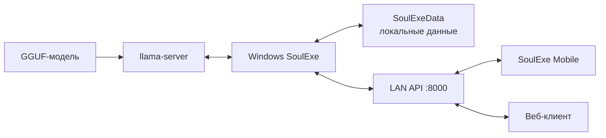

# SoulExe

**SoulExe** — локальное приложение для ролевых диалогов с ИИ-персонажами. Windows-клиент запускает GGUF-модель через `llama-server`, хранит персонажей, переписки и память на компьютере, а Android-клиент подключается к нему по домашней Wi‑Fi/LAN-сети.

Переписки не требуют облачного сервиса: основная база находится в каталоге `SoulExeData` рядом с программой. Модель и `llama-server` в архив релиза не входят и выбираются пользователем.

## Основные возможности

### Диалоги и персонажи

- отдельные истории с одним персонажем, поиск, закрепление, переименование и удаление чатов;
- групповые сцены с двумя персонажами, ручными и автоматическими ходами;
- сообщения от лица пользователя, выбранной персоны или режиссёра;
- действие **Continue** для продолжения реплики без пользовательского сообщения;
- редактор персонажей, персон пользователя, лорбуков, системных инструкций и аватаров;
- импорт и экспорт карточек персонажей;
- визуальное оформление речи, действий в `*звёздочках*` и блоков `<think>`.

### Память и контекст

- свежая история, краткая Summary и структурированная Soul Memory;
- факты, отношения, события, дневник, профиль пользователя и индекс памяти;
- профили памяти с понятными готовыми пресетами;
- три режима обслуживания: **после паузы**, **сразу по интервалу** и **только вручную**;
- единый когнитивный проход, уменьшающий число дополнительных обращений к модели.

### Живое поведение

- реалистичная задержка ответа от 3 до 120 секунд, зависящая от длины сообщения;
- короткие фразы до 20 символов обрабатываются быстрее;
- инициативные сообщения персонажа после долгого молчания — не более трёх в сутки;
- настраиваемые ночные часы для инициативных сообщений;
- постепенное появление текста во время генерации и статус «печатает».

### SoulExe Mobile

- автоматический поиск запущенного SoulExe в локальной сети;
- вход по локальному логину и паролю и демо-режим без ПК;
- общие с Windows персонажи, персоны, аватары, чаты и сцены;
- создание и редактирование карточек с телефона;
- современный интерфейс Expo/React Native + NativeWind;
- корректная работа с Android-клавиатурой, жестами назад и системными отступами;
- Android foreground service, который поддерживает связь с ПК и показывает уведомления с именем персонажа и очищенным текстом сообщения.

## Как устроено приложение



Windows-клиент является главным узлом: он запускает модель, ведёт память и хранит данные. Телефон не запускает нейросеть самостоятельно. Для настоящих чатов и фоновых уведомлений компьютер должен быть включён, SoulExe должен работать, а телефон — видеть ПК в локальной сети или через VPN.

## Быстрый старт

1. Откройте [Releases](https://github.com/wericool/SoulExe/releases).
2. Для Windows скачайте `SoulExe-Windows-x64-v2.0.0.zip`, полностью распакуйте архив и запустите `SoulExe.exe`.
3. Укажите `llama-server.exe` и совместимую GGUF-модель в настройках приложения.
4. Для телефона скачайте `SoulExe-Mobile-Android-v2.0.0.zip`, распакуйте APK и установите его.
5. На ПК откройте **Настройки → Мобильный**, задайте логин и пароль и включите автозапуск мобильного сервера.
6. Подключите телефон к той же сети и воспользуйтесь автоматическим поиском SoulExe.

Windows может показать предупреждение брандмауэра. Разрешайте доступ только для доверенной частной сети. Не публикуйте порт 8000 напрямую в интернете.

## Структура репозитория

| Путь | Содержимое |
|---|---|
| корень репозитория | Актуальный Windows WPF-клиент на .NET 8, локальный API, память и встроенный веб-клиент. |
| `mobile/` | Актуальный Android-клиент на Expo/React Native/NativeWind вместе с нативным foreground service. |
| `docs/` | Подробное описание функций, архитектуры и сборки. |
| `OLD` | Ветка с прежней основной версией проекта до текущего редизайна. |
| `new-style` | История разработки нового Windows-интерфейса. |

Готовые EXE, APK и ZIP не хранятся в исходной ветке — они публикуются в GitHub Releases.

## Сборка Windows

Требования: Windows 10/11, .NET 8 SDK и Windows SDK.

```powershell
git clone https://github.com/wericool/SoulExe.git
cd SoulExe
dotnet restore SoulExe.csproj
dotnet publish SoulExe.csproj -c Release -r win-x64 --self-contained true
```

Готовая публикация создаётся в каталоге `../OutputNewStyle/Release/win-x64/publish` относительно клона. Это задаётся проектом `SoulExe.csproj`.

## Сборка Android

Требования: Node.js, pnpm, JDK 17 и Android SDK.

```powershell
cd mobile
pnpm install
pnpm check
cd android
.\gradlew.bat assembleRelease
```

APK появится в `mobile/android/app/build/outputs/apk/release/app-release.apk`.

Для официальной подписи скопируйте `mobile/android/keystore.properties.example` в `keystore.properties` и укажите собственный закрытый keystore. Настоящий файл подписи и пароли исключены из Git. Без него Gradle создаст APK с локальной отладочной подписью, подходящий только для разработки.

## Данные и приватность

- личные диалоги, карточки и память находятся в `SoulExeData` и не добавляются в Git;
- `node_modules`, кэши, локальные ключи, APK/EXE и результаты сборки исключены из репозитория;
- LAN API защищается отдельными учётными данными, но рассчитан на доверенную сеть;
- foreground service является локальной связью с ПК, а не облачным push-сервисом;
- после закрытия Windows-клиента генерация и получение новых уведомлений прекращаются.

## Документация

- [Полный список возможностей](docs/FEATURES_RU.md)
- [Архитектура и синхронизация](docs/ARCHITECTURE_RU.md)
- [Установка и сборка](docs/GETTING_STARTED_RU.md)
- [Происхождение проекта](UPSTREAM.md)

## Лицензия

Проект распространяется по лицензии [GNU GPL-3.0](LICENSE). SoulExe развивается на основе идей и частей оригинального проекта [Soul of Waifu](https://github.com/jofizcd/Soul-of-Waifu); подробности сохранены в [UPSTREAM.md](UPSTREAM.md).
