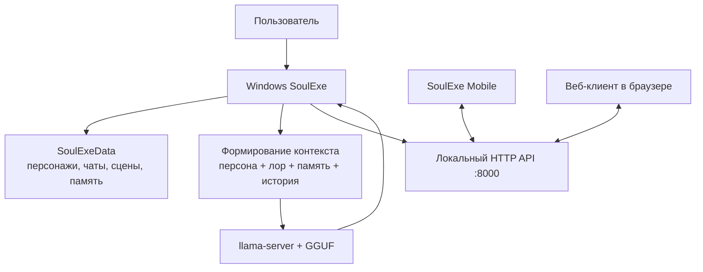

# Архитектура SoulExe и различия клиентов

## Общая модель

Windows-клиент — центральный узел SoulExe. Он хранит данные, запускает локальную модель, формирует контекст, ведёт память и предоставляет LAN API. Mobile и встроенный веб-клиент являются интерфейсами к этому же узлу, а не отдельными генераторами текста.

## Где лежат данные

Рабочие данные Windows-клиента находятся в каталоге `SoulExeData` рядом с EXE. Там хранятся JSON-данные, локальные аватары и служебная информация. Этот каталог не попадает в Git и не должен публиковаться вместе с исходниками или сборкой, если он содержит личные диалоги.

Мобильное приложение хранит только собственные локальные параметры подключения и оформления. История чатов, карточки и аватары берутся с ПК через LAN API.

## Как работает синхронизация

Синхронизация не использует облако и не требует WebSocket-сервера. Mobile-клиент регулярно получает актуальные списки и активную ленту, а Windows-клиент после операции с телефона получает локальное уведомление и обновляет свои данные. Такой подход проще для домашней LAN-сети и сохраняет один источник истины — Windows SoulExe.

В интерфейсе предусмотрено сравнение свежести данных перед заменой состояния. Поэтому тихий опрос не должен перерисовывать неизменившийся список или возвращать пользователя вниз, когда он вручную читает старые сообщения.

## Почему Windows и Mobile различаются

| Вопрос | Windows WPF | SoulExe Mobile |
|---|---|---|
| Запускает локальную модель | Да. | Нет, использует ПК. |
| Хранит основную базу | Да, в `SoulExeData`. | Нет, показывает данные ПК. |
| Глубокие настройки модели и памяти | Да. | Нет, это задача главного клиента. |
| Быстрое чтение и отправка с телефона | Возможно через веб-клиент. | Основной сценарий Mobile. |
| Работа без ПК | Только Windows-клиент с локальной моделью. | Демо-режим возможен, реальные данные — нет. |

## Локальный API и безопасность

LAN API использует отдельный логин и пароль, создаёт сессию и применяется только для доступа к Windows SoulExe с устройства в сети. Ссылка на аватар содержит сессионный параметр, потому что системный компонент отображения изображений в React Native не передаёт произвольные HTTP-заголовки на запрос изображения.

Это не является заменой полноценной сетевой защиты для публичного сервера. SoulExe следует использовать в доверенной локальной сети. Не пробрасывайте порт API наружу без отдельного reverse proxy, TLS, правил доступа и понимания рисков.

## Отличие от оригинального Soul of Waifu

SoulExe сохраняет направление локальных ролевых диалогов, но развивается как отдельная структура с Windows WPF-клиентом, LAN API и отдельным Mobile-клиентом. В репозитории SoulExe оригинальный архив не хранится; он указан в [UPSTREAM.md](../UPSTREAM.md) как источник происхождения. Полное совпадение интерфейса, кода или поведения с оригинальным приложением не заявляется.

## Ограничения архитектуры

1. Производительность определяется локальным железом, размером GGUF-модели, размером контекста и настройками генерации.
2. Телефону нужен работающий ПК с включённым SoulExe и доступом к той же сети.
3. Активная история в текущем интерфейсе загружается компактным свежим срезом; обратной постраничной навигации к неограниченно старым сообщениям пока нет.
4. Качество автоматических сцен зависит от устойчивости контекста и выбранной модели; сложные сцены могут требовать меньшего контекста, большего лимита ответа или ручного контроля хода.
